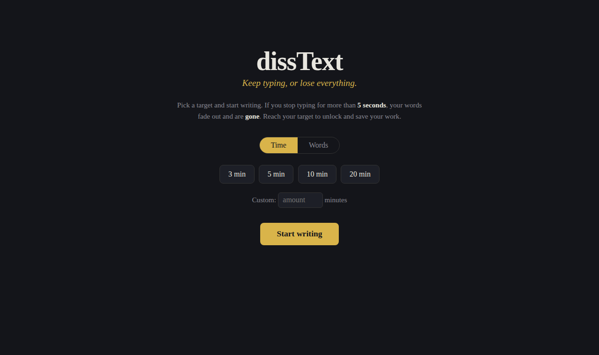

# dissText


An online writing app that punishes hesitation. Pick a target — a number of
minutes or a number of words — then start writing. As long as you keep typing
you're safe. **Stop typing for more than 5 seconds and your words fade out and
are wiped.** Reach your target to survive, at which point your text unlocks and
you can copy it or download it as a `.txt`.

Inspired by *The Most Dangerous Writing App*.



## How it works

A thin **Flask** backend serves a single page. All the timing, fading, and
wiping happens in the browser (JavaScript). Your draft is **never sent to the
server** — so if you lose it, it's genuinely gone. There's no database and
nothing to recover.

## Run it

```bash
pip install -r requirements.txt
python app.py
```

Then open <http://localhost:5000>.

## The rules

1. Choose **Time** (survive N minutes) or **Words** (reach N words).
2. Pick a preset or enter a custom amount, then **Start writing**.
3. Don't stop. The bar at the top drains while you're idle:
   green → yellow → red. In the last 2 seconds the whole page fades.
4. Type again before it hits zero and you recover.
5. Hit zero and the text is wiped. Reach your target and it's yours.

## Configuration

The grace period, fade duration, and preset targets are constants at the top of
`app.py` (`GRACE_SECONDS`, `FADE_SECONDS`, `TIME_PRESETS`, `WORD_PRESETS`).
